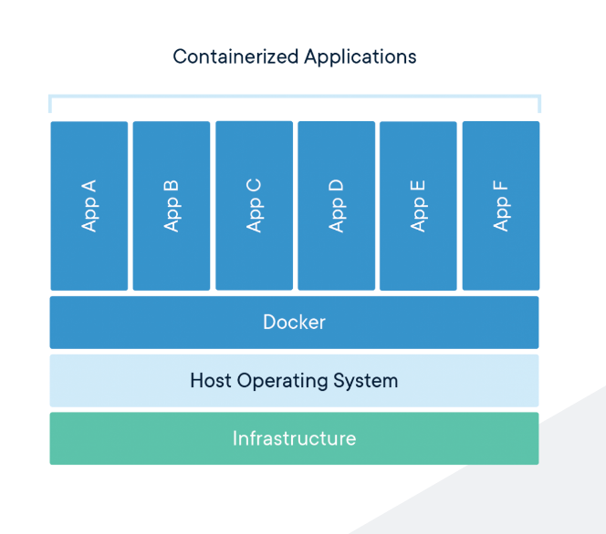

# [Docker 、　k8s简介](https://my.oschina.net/jamesview/blog/2994112)

## 1、什么是docker
Docker 是一个开源的应用容器引擎，让开发者可以打包他们的应用以及依赖包到一个可移植的镜像中，然后发布到任何流行的 Linux或Windows 机器上，也可以实现虚拟化。容器是完全使用沙箱机制，相互之间不会有任何接口.

## 2、为什么大家都在使用docker

* 服务隔离

* 易迁移

* 易管理

* 开销低

* 可以做集成测试

## 3、docker组成
1、DockerClient客户端

2、Docker Daemon守护进程

3、Docker Image镜像

4、DockerContainer容器

## 4、[配置云加速](https://cr.console.aliyun.com/cn-shanghai/instances/mirrors)
配置阿里云的云加速

## 5、[docker核心，Dockerfile](https://www.jianshu.com/p/168fbb97b447)

## 6、应用核心 docker-compose

pip install docker-compose